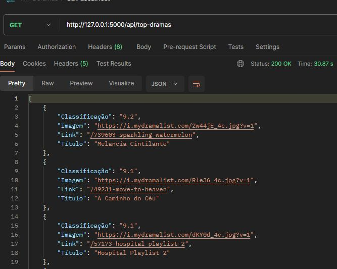

## 🐍 MDL Flask API


### 📌 Descrição

**MDL Flask API** é uma aplicação simples para coletar informações de **Doramas (K-Dramas)** no [MyDramaList](https://mydramalist.com/) usando **Web Scraping com BeautifulSoup** e expor esses dados através de uma **API RESTful construída com Flask**.

Esse projeto demonstra como unir **extração de dados da web**, **criação de endpoints com Flask** e **retorno em JSON**, servindo como um ponto de partida para projetos mais robustos de **Engenharia de Dados**, **APIs ou Automação**.

---

## 🚀 Funcionalidades

* 📄 **Web Scraping:** coleta informações de dramas, como título, sinopse e nota.
* 🔗 **API REST:** endpoints para acessar os dados de forma estruturada.
* ⚙️ **Estrutura simples:** fácil de entender, ideal para estudos.
* ✅ **JSON Output:** dados limpos prontos para consumo por outros sistemas.

---

## 📸 Imagens




---

## 📁 Estrutura do Projeto

```plaintext
📂 mdl-flask-api/
 ├── app.py
 ├── .gitignore
 ├── Procfile
 ├── requirements.txt
 ├── README.md
 ├── images/
 │    ├── api.jpeg
```

---

## 🛠️ Tecnologias Utilizadas

* **Python 3.10**
* **Flask**
* **BeautifulSoup**
* **Requests**

---

## ▶️ Como Executar

1️⃣ Clone o repositório:

```bash
git clone https://github.com/nandodevs/mdl-flask-api.git
cd mdl-flask-api
```

2️⃣ Crie um ambiente virtual:

```bash
python -m venv venv
source venv/bin/activate  # Linux/Mac
venv\Scripts\activate     # Windows
```

3️⃣ Instale as dependências:

```bash
pip install -r requirements.txt
```

4️⃣ Execute o projeto:

```bash
python app.py
```

Acesse: [http://localhost:5000](http://localhost:5000)

---

## 📌 Próximos Passos

* [ ] Adicionar testes automatizados.
* [ ] Melhorar tratamento de erros do scraping.
* [ ] Criar documentação OpenAPI (Swagger).
* [ ] Implantar em um servidor cloud (Heroku, Render, Railway).

---

## 🤝 Contribuições

Fique à vontade para abrir **Issues**, enviar **Pull Requests** ou sugerir melhorias!

---

## 📄 Licença

Este projeto está licenciado sob a **MIT License**.

---

## ✨ Autor

**Sisnando Junior**
[LinkedIn](https://www.linkedin.com/in/sisnando-junior/) • [GitHub](https://github.com/nandodevs)

---

